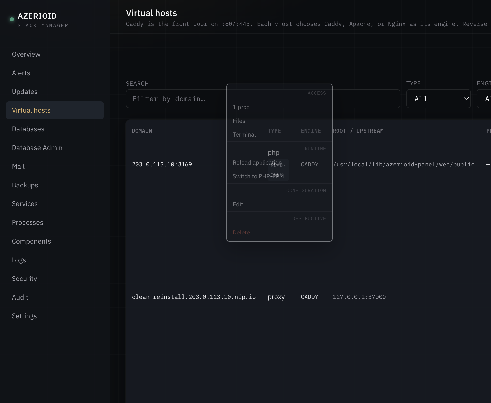
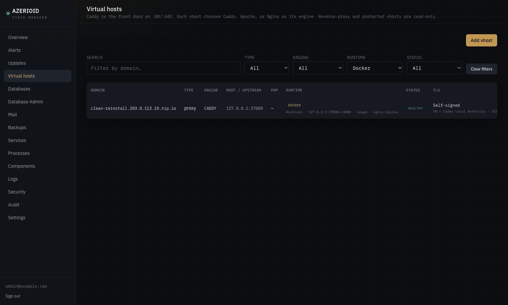
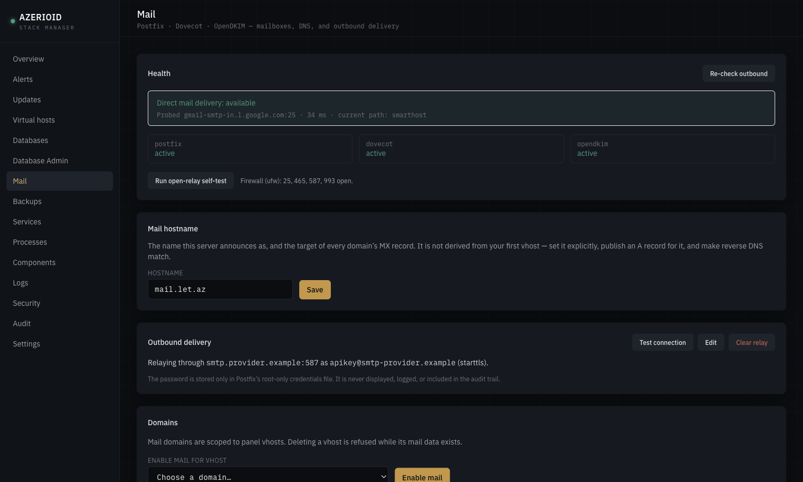

# AZERIOID Stack Manager

**One host. One panel. A full Linux web stack you control.**

AZERIOID Stack Manager is a self-contained stack manager and web control panel for operators who run sites on a single Linux server. One installer bootstraps **Caddy**, a dedicated **PHP 8.4 FPM** pool, and a **SQLite**-backed admin UI on **Laravel 13 + Livewire 4**. Everything else — Nginx, Apache, databases, cache, PHP site runtimes, Node.js, Supervisor, mail, rootless Docker — installs on demand from the dashboard or the matching CLI, using official upstream packages.

Built for VPS and bare-metal operators who want a clean bootstrap, a real UI for day-two work, and a privileged broker that keeps package installs and host changes out of the web app process.

## Screenshots

Captured from a live Ubuntu 24.04 panel host (UI anonymized where needed). Reflects the post–v1.6 Virtual Hosts redesign and current Mail / runtime pages.

| Overview | Virtual hosts |
|:---:|:---:|
|  |  |

| Virtual hosts · row actions | Docker runtime filter |
|:---:|:---:|
|  |  |

| Mail | Databases |
|:---:|:---:|
|  |  |

| Terminal | File Manager + editor |
|:---:|:---:|
|  |  |

| Components | Security |
|:---:|:---:|
|  |  |

## What ships out of the box vs on demand

### Bootstrap (automatic)

| Piece | Role |
|-------|------|
| **Caddy** | Panel vhost on port **3169**; front door on `:80`/`:443` for sites |
| **PHP 8.4 FPM** | Dedicated panel pool — isolated from site PHP versions |
| **SQLite** | Panel state under `/var/lib/azerioid-panel/` |
| **Broker** | Privileged host driver (sudoers); UI never runs `apt`/`dnf` itself |
| **Queue worker** | Background component install/remove jobs |

### On demand (Components page or `azerioid component`)

| Category | Components |
|----------|------------|
| **Web engines** | Nginx, Apache (loopback backends; Caddy terminates TLS) |
| **Databases** | MariaDB, PostgreSQL, MongoDB |
| **Cache / KV** | Redis, Memcached |
| **Runtimes** | PHP 8.1–8.3 (site pools); Node.js 20 / 22 / 24 |
| **Process manager** | Supervisor (programs run as `azerioid-supervised`, never root) |
| **Per-vhost app runtimes** | Opt-in: PHP-FPM (default), Laravel Octane / FrankenPHP, PM2 Node cluster, rootless Docker — chosen at create time or enabled later |
| **Mail** | Postfix + Dovecot + OpenDKIM (opt-in; authenticated submission only, virtual mailboxes, DKIM/SPF/DMARC guidance, direct or smarthost outbound) |
| **Tools** | Adminer (panel session–gated SQL UI; MariaDB / PostgreSQL / SQLite — not MongoDB) |

## Feature highlights

Proven on supported distros in operator testing — not marketing vapor:

- **Multi-engine virtual hosts** — each site chooses Caddy, Apache, or Nginx independently; Caddy always owns `:80`/`:443`. Create-time runtime intent picks Traditional (PHP-FPM), Octane, PM2, or Docker up front; the Virtual Hosts list uses status/runtime badges, search/filters, and a consolidated row-actions menu
- **HTTPS** — Let's Encrypt HTTP-01 (automatic), self-signed/`tls internal` (extensively used), DNS-01 via Cloudflare/DigitalOcean (supported; lightly tested vs internal TLS)
- **High-performance runtimes (opt-in per vhost)** — Laravel **Octane (FrankenPHP)** for Laravel apps and **PM2 cluster mode** for Node apps, both on the same Supervisor + Caddy foundation, with reload paths aimed at zero-downtime worker replacement. New PHP vhosts stay on PHP-FPM unless you opt in; the panel’s own runtime never uses Octane
- **Rootless Docker (opt-in per vhost)** — pull an image or build from Dockerfile/compose in the site tree; container shell and log streaming from the panel. Daemon runs only as `azerioid-supervised` (no `docker` group, rootful Docker masked) — least-privilege layout adversarially tested so a bind-mount cannot escalate to host root
- **Mail server (opt-in)** — per-domain mailboxes and aliases on Postfix/Dovecot/OpenDKIM, copy-paste MX/SPF/DKIM/DMARC records with live verification, full send+receive when DNS is correct. **Direct MX delivery and smarthost/relay are equally first-class**: most cloud providers block outbound port 25, so the health strip probes reachability and steers you to a relay when needed — a duality many competing panels never surface. Replacing an existing MTA always requires a typed `REPLACE-MTA`; deleting a mail-enabled vhost requires `DROP-MAIL`
- **Databases with remote access modes** — localhost / specific IPs / global (with explicit confirmation); MariaDB and PostgreSQL enforce per-database host rules; MongoDB remote access is instance-wide firewall
- **Adminer** — installable SQL admin UI for MariaDB / PostgreSQL / SQLite, reachable only through the panel’s authenticated session (never independently exposed)
- **Per-vhost Terminal and File Manager** — broker drops to the vhost user (`az-vh-…`); path traversal and symlink escape rejected
- **Supervisor processes** — create/start/stop/logs from UI or CLI
- **CLI parity** — `azerioid` wraps the same broker path as the dashboard (`origin=cli` in audit)
- **Tag self-update** — `azerioid panel update check|apply` installs semver git tags (latest or `--v=<tag>`), refuses dirty trees, and rolls back automatically if apply fails mid-update
- **White-label panel domain** — bind the panel to a hostname on `:443`; IP:3169 and SSH tunnel stay as fallback

**Honest limits:** single admin (no multi-user RBAC yet). Archive extract is not offered in the File Manager (zip-slip scoped out). Mail ships without webmail, spam filtering, quotas, or catch-all addresses; deliverability still depends on reverse DNS you set at your VPS provider. Octane is Laravel-only; PM2 is Node-only; Docker compose host mounts are bounded by what `azerioid-supervised` can already access (not equivalent to root).

## Supported operating systems

Verified end-to-end on the current stack (**Laravel 13 + Livewire 4**, including mail / Octane / PM2 / rootless Docker paths where those features apply):

| OS | Support | Notes |
|----|---------|-------|
| **Ubuntu 24.04** | Supported | Verified |
| **Debian 12 / 13** | Supported | Verified |
| **AlmaLinux 9+** | Supported | Verified with **SELinux Enforcing** |
| **Rocky Linux 9+** | Supported | Verified with **SELinux Enforcing** (same EL path as AlmaLinux) |
| **CentOS Stream 9+** | Supported | Verified with **SELinux Enforcing** (same EL path; `ID=centos`) |
| **RHEL / Oracle Linux 9+** | Supported (same EL path) | Same installer/SELinux helpers |
| **Fedora** | **Not supported** | Installer refuses correctly |

Requirements: root, outbound HTTPS, `git`.

## Quick start

```bash
git clone https://github.com/azerioid/azerioid-stack-manager.git stack-manager && cd stack-manager
chmod +x stack-manager.sh
sudo ./stack-manager.sh
```

**Interactive install** (TTY) prompts for:

- Access mode — `tunnel` (default, `127.0.0.1:3169`) or `public` (HTTPS on the host IP)
- Panel port, optional TOTP requirement, firewall, fail2ban, IP allowlist
- Optional admin creation (email + password)

Non-interactive example:

```bash
sudo ./stack-manager.sh --non-interactive --access=public --create-admin=true --admin-email=you@example.com
# Set ADMIN_PASSWORD in the environment — never pass passwords on argv
```

Tunnel access after a default install:

```bash
ssh -L 3169:127.0.0.1:3169 user@host
# open http://127.0.0.1:3169/setup  (or /login if an admin was created)
```

Optional hardening flags: `--firewall=true`, `--fail2ban=true`, `--require-totp=true`. Full list: `sudo ./stack-manager.sh --help`.

On any **public** install, change the admin password immediately after first login if you used a weak or default value.

## Security model (brief)

- Least-privilege **broker** — privileged work is sudo + broker, not the Laravel process
- **Registry-gated** installs — only components defined under `registry/components/`
- Panel PHP isolated (dedicated FPM pool, locked-down `disable_functions`)
- **Livewire actions authorize server-side** (Phase 2/3 hardening) — UI hiding is not the control boundary
- **Rootless Docker only** for panel-managed containers — rootful `docker.service` / `docker.socket` are disabled and masked; no `docker` group path (group membership is root-equivalent)
- **Mail anti-abuse** — not an open relay (`mynetworks` localhost-only; SASL on submission 587/465 only); open-relay self-test before “healthy”; typed confirms for `REPLACE-MTA` / `DROP-MAIL`
- Localhost-first defaults for panel bind and managed DB/cache
- **Adminer** only behind the panel session — not a separately published vhost
- Optional TOTP, fail2ban jail, ufw/firewalld rules
- DNS-01 API tokens (and mail/smarthost secrets) stored root-only; never accepted on argv

Details: [`docs/SPEC.md`](docs/SPEC.md), [`docs/DECISIONS.md`](docs/DECISIONS.md), [`docs/port-ownership.md`](docs/port-ownership.md).

## CLI examples

```bash
azerioid status
azerioid vhost list --json
azerioid vhost add --domain=app.example.com --type=php --php=8.4 --root=/data/www/app.example.com --tls=auto
azerioid vhost add --domain=api.example.com --type=php --php=8.4 --runtime=octane --tls=auto
azerioid vhost octane enable --domain=api.example.com
azerioid vhost octane reload --domain=api.example.com
azerioid vhost pm2 enable --domain=node.example.com --instances=2 --entry=server.js
azerioid vhost docker enable --domain=app.example.com --mode=image --image=nginx:alpine --internal-port=80
azerioid db add --engine=mariadb --name=appdb --user=appdb
azerioid component install redis
azerioid component install mail   # refuses foreign Exim/Sendmail unless --option=confirm=REPLACE-MTA
azerioid component install adminer
azerioid process create --vhost=app.example.com --command='node server.js' --name=app-node
azerioid mail hostname set --hostname=mail.example.com
azerioid mail domain enable --domain=app.example.com
azerioid mail mailbox add --address=inbox@app.example.com   # password printed once
azerioid mail status   # “Direct mail delivery: available” or “…blocked… configure a relay”
azerioid mail smarthost set --host=smtp.provider.example --port=587 --username=apikey
# relay password: AZERIOID_RELAY_PASSWORD=… (never argv)
azerioid mail dns --domain=app.example.com
azerioid panel update check
azerioid panel update apply --v=v1.6.0 --confirm
```

Secrets (DB passwords, DNS tokens, backup passphrase, TOTP re-auth, mail/smarthost passwords) go through the environment or one-time stdout — not argv flags. Full surface: `azerioid help`.

## Uninstall

Panel only:

```bash
sudo ./deploy/uninstall.sh --drop-db --remove-bootstrap
```

Full teardown (panel + broker-managed components + added repos). Intentionally **retains** site trees under `/data/www` and panel/broker logs under `/var/log/azerioid-panel` (audit trail after reinstall):

```bash
sudo ./deploy/uninstall.sh --full
```

## License

MIT — see `web/composer.json`.

## Contributing

Issues and pull requests: [azerioid/azerioid-stack-manager](https://github.com/azerioid/azerioid-stack-manager). Architecture decisions live in [`docs/DECISIONS.md`](docs/DECISIONS.md); keep ADR history intact when proposing changes.
