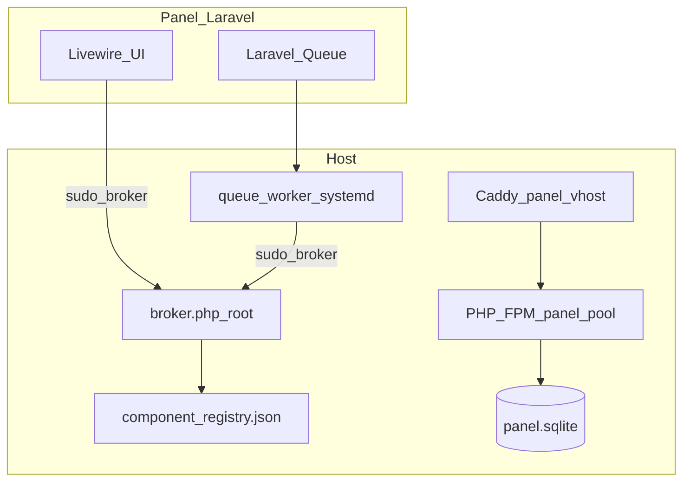

# AZERIOID Stack Manager — Master Specification

Working title: **AZERIOID Stack Manager** (formerly LACMP Panel). A self-contained host control plane for managing web stacks on Linux.

## Architecture

| Layer | Path | Role |
|-------|------|------|
| Panel UI | `/usr/local/lib/azerioid-panel/web` | Laravel 12 + Livewire admin |
| Broker | `/usr/local/lib/azerioid-panel/broker` (`AzerioidPanel\Broker`) | Privileged host operations (sudo) |
| Registry | `registry/components/*.json` | Component metadata (detect/install data) |
| Panel DB | `/var/lib/azerioid-panel/panel.sqlite` | SQLite — panel state only |
| Panel FPM | `/run/php/azerioid-panel.sock` | Isolated PHP 8.4 pool (user `caddy`) |
| Panel vhost | `/etc/caddy/conf.d/azerioid-panel.conf` | Localhost tunnel on `:3169` |

## Panel runtime isolation (A1)

The panel runs on a **dedicated PHP-FPM pool** pinned to PHP **8.4**. This is a **system component** — visible in Settings and Components, non-removable. User-installed PHP versions are separate pools managed in later phases.

- Socket: `/run/php/azerioid-panel.sock`
- Pool user: `caddy` (matches Caddy service user)
- Version pin: `PANEL_PHP_VERSION=8.4` recorded in `/etc/azerioid-panel/runtime.json`
- Broker refuses removal of the pinned PHP version while the panel depends on it

## Managed vs observed vs system (A14)

| Kind | `managed` | `system` | Example |
|------|-----------|----------|---------|
| System | — | `true` | `caddy`, `php-8.4` (panel runtime) |
| Managed | `true` | `false` | `redis`, `mariadb` (P3+) |
| Observed | `false` | `false` | Foreign services in `observed_services` |

P3: Redis install/uninstall via queued broker jobs. MariaDB/PostgreSQL in P4. Adopt flow in P5.

## Security model (A8)

- **Broker-only package ops**: the web UI never runs `apt`/`dnf` directly; all privileged work goes through the broker binary via sudo.
- **Localhost-first**: panel Caddy binds `127.0.0.1:3169` by default (SSH tunnel).
- **Application DBs**: MariaDB/PostgreSQL/Mongo default to localhost-only when installed (P3+).
- **FPM lockdown**: panel pool disables dangerous functions; public pools retain `proc_open` lockdown.

## Migration policy (A2)

Fresh installs target SQLite at `/var/lib/azerioid-panel/panel.sqlite`. Legacy MariaDB panel databases are migrated via **adopt + `migrate.sh`** (P5 adopt flow, P7 `migrate.sh` script). P1 does not implement migration.

## RBAC (A15)

v1 is **single admin**. Schema keeps `users.role` nullable/string for future RBAC.

## Node.js scope (A16)

v1 Node.js is **runtime install only** — no PM2 or process manager integration.

## Bootstrap mode (P1)

The installer no longer requires `lcmp`/`lamp` on PATH. Default is `bootstrap-stack=minimal`:

1. Caddy (official repo)
2. PHP 8.4 FPM + CLI (Sury on deb, Remi on EL)
3. SQLite panel database
4. Queue worker (`azerioid-panel-queue.service`)

Bootstrap-installed packages are tracked in `/etc/azerioid-panel/bootstrap.json` for selective uninstall.

## Job system (A6)

- `QUEUE_CONNECTION=database` with SQLite
- systemd unit `azerioid-panel-queue.service` runs `php artisan queue:work`
- `PingJob` proves the worker processes jobs on install

## Phase exit criteria

Every phase exit runs `deploy/test/smoke-p1.sh` against Ubuntu 24.04, Debian 12, and EL 9 (SELinux enforcing).

## Phase 6 scope

- Installable: PHP 8.1/8.2/8.3 (Sury on deb, Remi on EL), Node.js 20/22/24 (NodeSource), Memcached, MongoDB 8.0 (official repo, localhost + auth, SSPL noted in registry)
- `component.install` accepts `options` (e.g. `node_major` for Node.js)
- Panel PHP 8.4 remains system-managed and non-removable
- Smoke: `sudo ./deploy/test/smoke-p6.sh`

## Path layout (A19)

| Path | Purpose |
|------|---------|
| `/usr/local/lib/azerioid-panel` | Install root (broker, web, registry) |
| `/etc/azerioid-panel` | `broker.json`, `runtime.json`, `bootstrap.json` |
| `/var/lib/azerioid-panel` | SQLite DB, staging, managed-components |
| `/var/log/azerioid-panel` | Panel audit + auth-fail logs |

Upgrades from `lacmp-panel` paths: `sudo ./deploy/relocate-from-lacmp.sh`

## Phase 7 scope

- `deploy/migrate.sh` — copies legacy MariaDB `lacmp_panel` panel state into `/var/lib/azerioid-panel/panel.sqlite`
- `php artisan panel:import-from-mariadb` — table-by-table import (shared columns only); site DBs untouched
- Migration marker: `/var/lib/azerioid-panel/panel-db-migrated.json`
- Smoke: `sudo ./deploy/test/smoke-p7.sh`

## Migration workflow (A2)

1. Upgrade panel code / run bootstrap installer on legacy host
2. **Adopt** MariaDB from Components (P5) — broker admin creds only
3. `sudo ./deploy/migrate.sh` — panel users, settings, jobs, audit logs → SQLite
4. Optionally drop `lacmp_panel` schema when satisfied (site databases remain)
