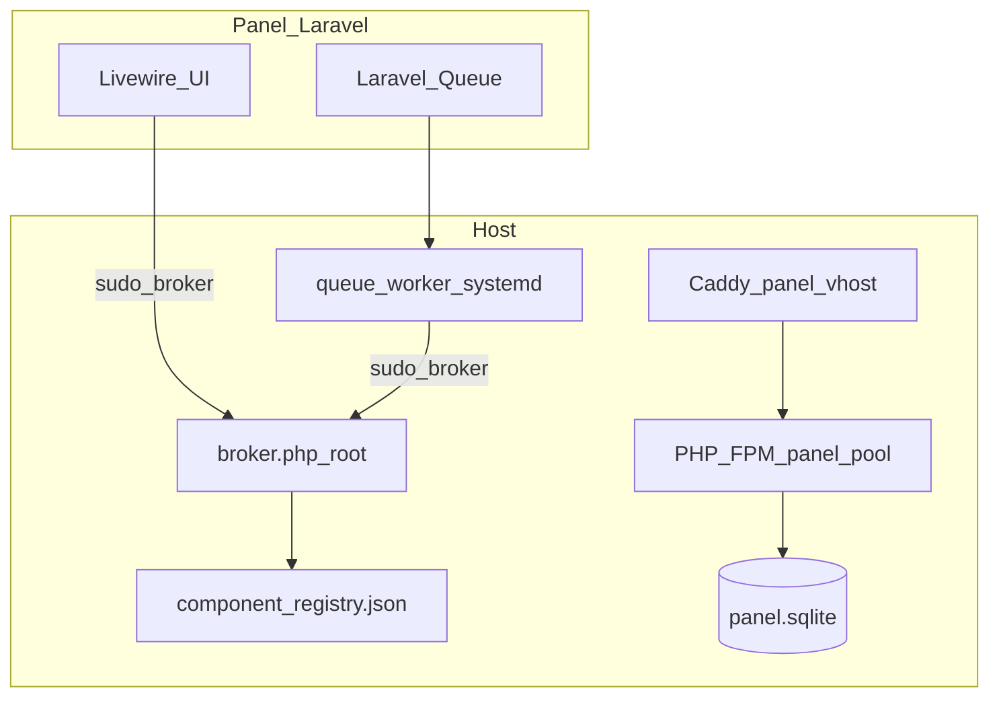

# AZERIOID Stack Manager — Master Specification

Working title: **AZERIOID Stack Manager**. A self-contained host control plane for managing web stacks on Linux.

## Architecture

| Layer | Path | Role |
|-------|------|------|
| Panel UI | `/usr/local/lib/azerioid-panel/web` | Laravel 12 + Livewire admin |
| Broker | `/usr/local/lib/azerioid-panel/broker` (`AzerioidPanel\Broker`) | Privileged host operations (sudo) |
| Registry | `registry/components/*.json` | Component metadata (detect/install data) |
| Panel DB | `/var/lib/azerioid-panel/panel.sqlite` | SQLite — panel state only |
| Panel FPM | `/run/php/azerioid-panel.sock` | Isolated PHP 8.4 pool (user `caddy`) |
| Panel vhost | `/etc/caddy/conf.d/azerioid-panel.conf` | Localhost tunnel on `:3169`; optional `https://<IP>:3169` + 421 catch-all; optional white-label hostname on `:443` |

## Panel runtime isolation (A1)

The panel runs on a **dedicated PHP-FPM pool** pinned to PHP **8.4**. This is a **system component** — visible in Settings and Components, non-removable. User-installed PHP versions are separate pools managed in later phases.

- Socket: `/run/php/azerioid-panel.sock`
- Pool user: `caddy` (matches Caddy service user)
- Version pin: `PANEL_PHP_VERSION=8.4` recorded in `/etc/azerioid-panel/runtime.json`
- Broker refuses removal of the pinned PHP version while the panel depends on it

## Managed vs observed vs system (A14)

| Kind | `managed` | `system` | Example |
|------|-----------|----------|---------|
| System | — | `true` | `caddy`, `php-8.4` (panel runtime) |
| Managed | `true` | `false` | `redis`, `mariadb` (P3+) |
| Observed | `false` | `false` | Foreign services in `observed_services` |

P3: Redis install/uninstall via queued broker jobs. MariaDB/PostgreSQL in P4. Adopt flow in P5.

## Security model (A8)

- **Broker-only package ops**: the web UI never runs `apt`/`dnf` directly; all privileged work goes through the broker binary via sudo.
- **Localhost-first**: panel Caddy binds `127.0.0.1:3169` by default (SSH tunnel). Optional public IP:3169 never answers for a Host that belongs to a site vhost (421 catch-all). Optional white-label hostname on `:443` (ADR A22).
- **Application DBs**: MariaDB/PostgreSQL/Mongo default to localhost-only when installed. Per-database remote access (localhost / specific IPs / global) is explicit: MariaDB GRANT hosts and PostgreSQL `pg_hba.conf` are per-database; MongoDB remote access is instance-wide firewall on 27017 only. Global mode requires a typed confirmation (`OPEN-GLOBAL` / CLI `--confirm`).
- **FPM lockdown**: panel pool disables dangerous functions; public pools retain `proc_open` lockdown. Site PHP-FPM pools (`www`) set `request_terminate_timeout=30` and `php_admin_value[max_execution_time]=30` so a hung script is killed in bounded time. Caddy `php_fastcgi` / Nginx `fastcgi_read_timeout` / Apache `ProxyTimeout` wait 35s so the reverse proxy does not hang indefinitely on a stuck worker.
- **Site HTTP ports**: when ufw/firewalld is active (panel `--firewall=true`, or database remote access), **80/443 stay allowed**. Enabling the firewall must never brick public vhosts.

## Panel database (A2)

Fresh installs target SQLite at `/var/lib/azerioid-panel/panel.sqlite`. There is no automated path to import a prior panel's MariaDB schema into SQLite — see `docs/DECISIONS.md` (A2 removed features). MariaDB **adopt** (bring an existing MariaDB server under panel management for site databases) remains supported and is separate from panel-database migration.

## RBAC (A15)

v1 is **single admin**. Schema keeps `users.role` nullable/string for future RBAC.

## Node.js scope (A16)

v1 Node.js is **runtime install only** — no PM2 or process manager integration.

## Bootstrap mode (P1)

The installer no longer requires `lcmp`/`lamp` on PATH. Default is `bootstrap-stack=minimal`:

1. Caddy (official repo)
2. PHP 8.4 FPM + CLI (Sury on deb, Remi on EL)
3. SQLite panel database
4. Queue worker (`azerioid-panel-queue.service`)

Bootstrap-installed packages are tracked in `/etc/azerioid-panel/bootstrap.json` for selective uninstall.

## Job system (A6)

- `QUEUE_CONNECTION=database` with SQLite
- systemd unit `azerioid-panel-queue.service` runs `php artisan queue:work`
- `PingJob` proves the worker processes jobs on install

## Phase exit criteria

Every phase exit runs `deploy/test/smoke-p1.sh` against Ubuntu 24.04, Debian 12, and EL 9 (SELinux enforcing).

## Phase 6 scope

- Installable: PHP 8.1/8.2/8.3 (Sury on deb, Remi on EL), Node.js 20/22/24 (NodeSource), Memcached, MongoDB 8.0 (official repo, localhost + auth, SSPL noted in registry)
- `component.install` accepts `options` (e.g. `node_major` for Node.js)
- Panel PHP 8.4 remains system-managed and non-removable
- Smoke: `sudo ./deploy/test/smoke-p6.sh`

## Path layout (A19)

| Path | Purpose |
|------|---------|
| `/usr/local/lib/azerioid-panel` | Install root (broker, web, registry) |
| `/etc/azerioid-panel` | `broker.json`, `runtime.json`, `bootstrap.json` |
| `/var/lib/azerioid-panel` | SQLite DB, staging, managed-components |
| `/var/log/azerioid-panel` | Panel audit + auth-fail logs |

## Per-vhost Terminal and File Manager

The panel FPM process **must not** read or write vhost document roots. Terminal sessions and the File Manager are broker actions that:

1. Reject read-only / system / reverse-proxy vhosts (same eligibility as each other).
2. Ensure a dedicated `az-vh-*` user (group `azerioid-vhosts`) for that domain.
3. Execute as that user (Terminal: `runuser` + ttyd; File Manager: PHP helper that `setuid`s after loading root-only broker classes).

File Manager actions: `vhost.files.list|read|write|mkdir|rename|move|delete`.

Path containment (both lexical and canonical):

- `VhostPath::lexicalJoin` rejects NUL, absolute relative paths, and `..` segments that climb above the vhost root.
- `realpath()` of the existing target (or of the parent, for create) must remain under the vhost root. Symlinks that resolve outside are rejected on read/write.
- Rename/move validates **both** source and destination.
- The helper does not create symlinks. Archive extract is **not** implemented (zip-slip scoped out of v1).
- Writes are size-capped (`vhost_files_max_bytes`, default 20 MiB). File bodies travel as `content_base64` on broker stdin and are redacted from audit logs; audit records action, vhost, path, admin, timestamp.

CLI: `azerioid vhost files list|read|write|delete|mkdir|rename`. Upload/download remain UI-only.

## Phase 7

Phase 7 originally shipped a legacy panel-DB migration path. That path has been **removed** (see DECISIONS A2). Remaining P5+ work is adopt/install/uninstall of managed components only.
